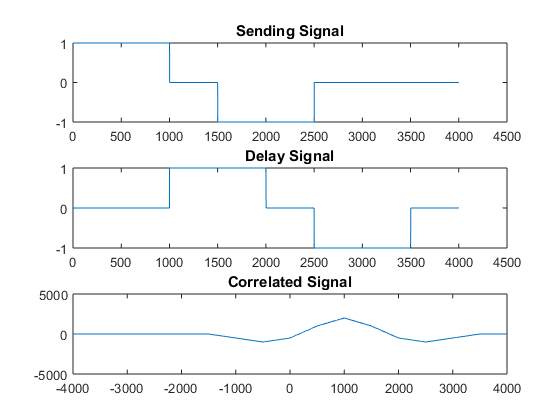

## Experiment No : 04

## Date of Submission : May 22, 2023

## Experiment Name :Experimental study about a practical use of correlation.

---

## Theory:

<p style="text-align: justify">
In signal processing, group delay and phase delay are delay times experienced by a signal's various frequency components when the signal passes through a linear time-invariant system (LTI), such as a microphone, coaxial cable, amplifier, loudspeaker, telecommunications system or ethernet cable. [1]
<p style="text-align: justify">
Time-shifting is an important operation that is used in many signal-processing applications. For example, a time-delayed version of the signal is used when performing autocorrelation. The time-shifted signal is also used in cross-correlation.
</p>

## Code:

```matlab
clc

t = 0:0.001:4;

a1 = t>=0 & t<=1;
a2 = t>=1.5 & t<=2.5;

a = a1-a2;

subplot(3, 1, 1);
plot(a);
title('Sending Signal',"fontsize", 20);

d1 = t>=1 & t<=2;
d2 = t>=2.5 & t<=3.5;
d = d1-d2;

subplot(3, 1, 2);
plot(d);
title('Delay Signal',"fontsize", 20);

N = -(length(t)-1):(length(t)-1);
corr = xcorr(d,a);
corr;
subplot(3, 1, 3);
plot(N,corr);
title('Correlated Signal',"fontsize", 20);

% max value
maxx = max(corr);
F = find(corr == maxx);
ind = F-length(t)
```

## Output:



```
ind=1000
```

## Discussion and Conclusion:

<p style="text-align: justify">

The code was executed and the output was verified. The output was plotted and the graph was observed according to the theory.

</p>


