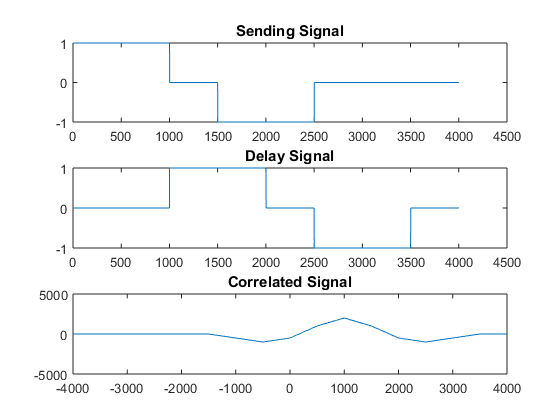

## Experiment No : 05

## Date of Submission : June 11, 2023

## Experiment Name :Experimental study of implementing Causal, Anti-Causal & Non-Causal signal.

---

## Theory:
<p style="text-align: justify">
  <strong>Causal Signal:</strong> A continous time signal x(t) which is said to be causal if x(t) = 0 for t<0.
  <strong>Anti-Causal Signal:</strong> A continous time signal x(t) which is said to be anti-causal if x(t) = 0 for t>0.
  <strong>Non-Causal Signal:</strong> A continous time signal x(t) which is said to be non-causal if x(t) is non zero for t>0.
</p>


## Code:

```matlab
% Causal 
clc
x = [2 3 4 5 3];
syms y

Cs = 0;
for i=1:length(x)
    Cs = Cs + x(i) * y^(1-i);
end
display(Cs);

% Anti-causal
At_cs = 0;
for i=length(x):-1:1
    At_cs = At_cs + x(i) * y^(length(x)-i);
end
display(At_cs);

% Non-causal
max_ind = 4; % from mid value
ind = find(max_ind==x);
N_Cs = 0;
for i=1:length(x)
    N_Cs = N_Cs + x(i) * y^(ind-i);
end
display(N_Cs);
```

## Output:


<p style = "text-align: center">
  Fig 4.1: Output of correleted signal of a normal and delayed signal
</p>

```
ind=1000
```

## Discussion and Conclusion:

<p style="text-align: justify">

The code was executed and the output was verified. The output was plotted and the graph was observed according to the theory.

</p>

